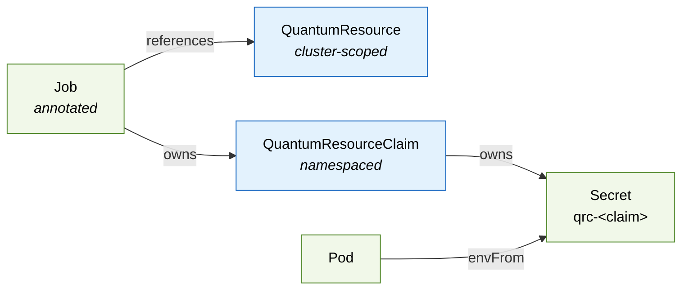
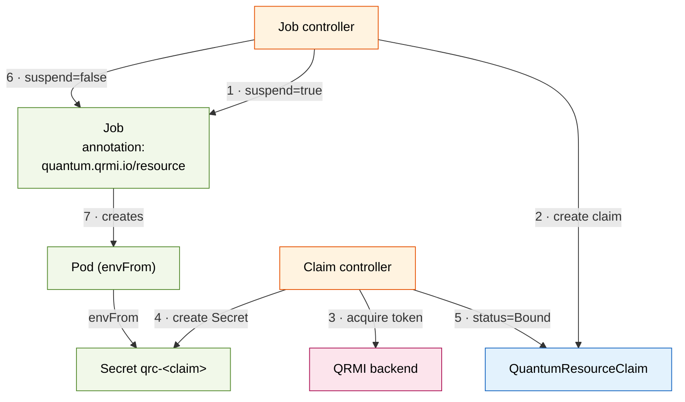
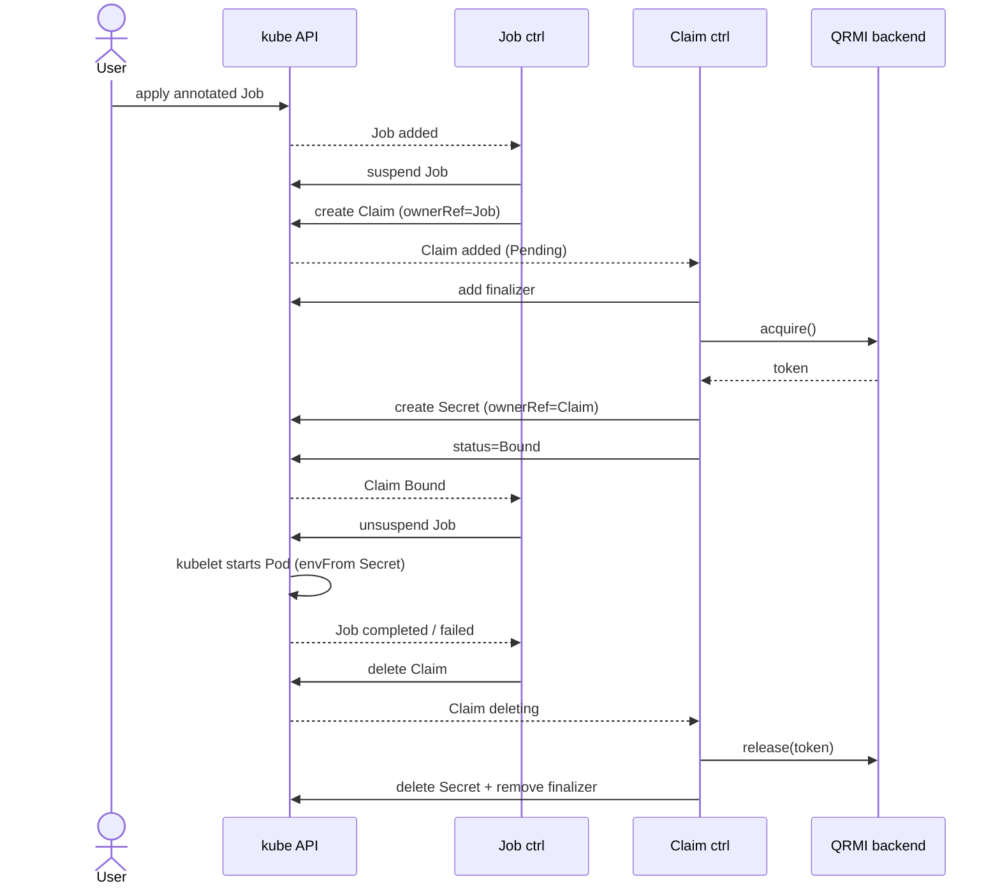
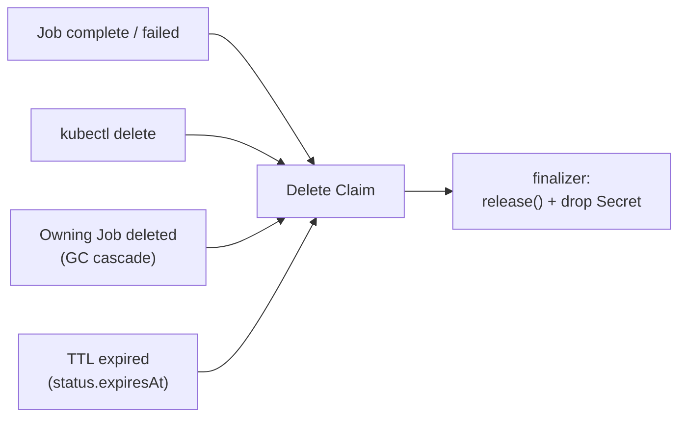

# QRMI Operator Architecture

Visual companion to [`DESIGN_OUTLINE.md`](./DESIGN_OUTLINE.md). The operator coordinates two
custom resources, annotated Jobs, a managed Secret, and the QRMI backend's `acquire()` /
`release()` calls.

## Resources at a glance

## Happy path: how a claim gets bound

Two controllers run in the operator. The Job controller reacts to annotated Jobs; the Claim
controller does the actual `acquire()` and builds the Secret. Steps are numbered in order.

## Lifecycle sequence

## Cleanup & deletion triggers

Deleting a `QuantumResourceClaim` runs the finalizer (`quantum.qrmi.io/finalizer`), which calls
`release()` and removes the Secret. Four things can trigger that deletion:

